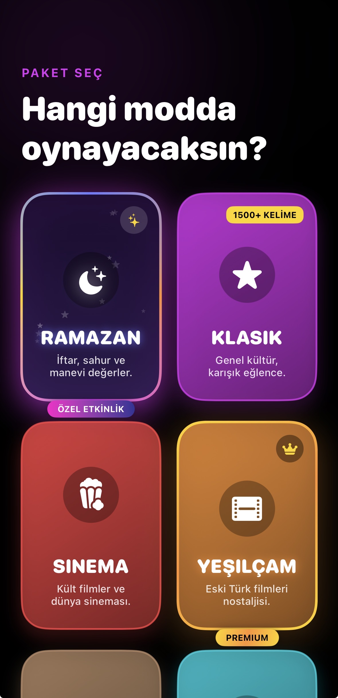
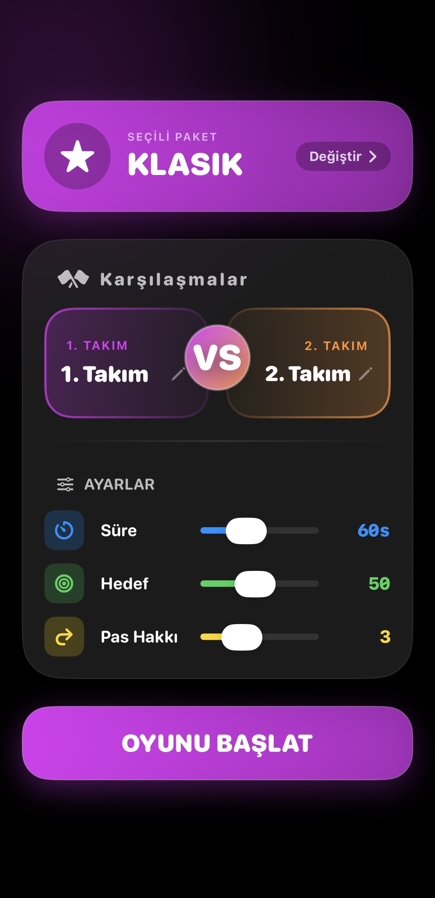
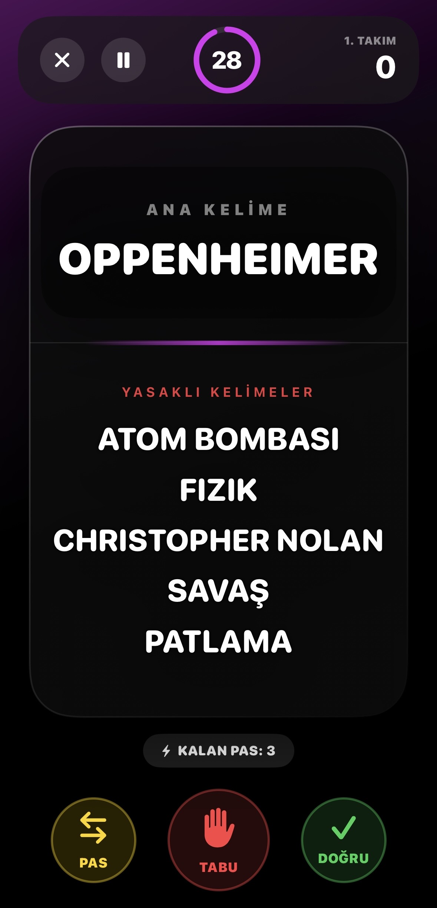
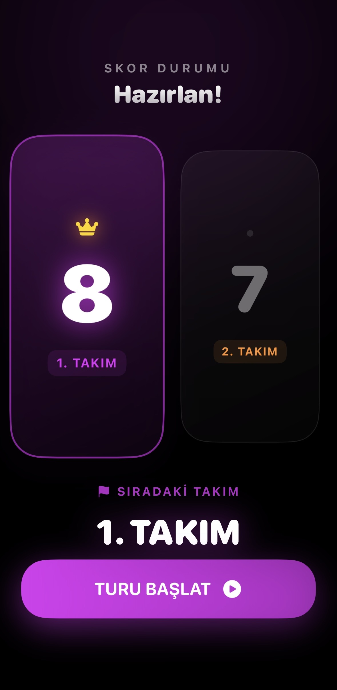

# 🚀 WordGuess (Kelime Tahmin) - iOS


**WordGuess**, arkadaş ortamlarının vazgeçilmezi olan kelime tahmin oyununu modern, neon bir tasarım ve zengin bir içerikle mobil cihazlara taşıyan bir iOS uygulamasıdır. Klasik tahmin oyunlarının aksine, kullanıcı deneyimine (UX) odaklanan animasyonları ve tamamen ücretsiz geniş kelime haznesiyle öne çıkar.

## ✨ Öne Çıkan Özellikler

* 📚 **Geniş İçerik:** 2500+ güncel ve özenle seçilmiş kelime.
* 🎭 **Tematik Kategoriler:** Klasik, Sinema, Yeşilçam, Tarih, Spor, Bilim Kurgu ve Müzik paketleri.
* ⚔️ **Versus Modu:** İki takım arasında kıyasıya rekabet sağlayan, takımların isimlendirilebildiği gelişmiş oyun motoru.
* 🎨 **Neon & Modern UI:** Göz yormayan, yüksek kontrastlı ve tamamen SwiftUI ile geliştirilmiş karanlık mod odaklı arayüz.
* 🎉 **Tatmin Edici Animasyonlar:** Şampiyonluk ekranında konfeti patlamaları ve yaylı (spring) geçiş efektleri.
* ⚙️ **Esnek Ayarlar:** Tur süresi, hedef skor ve pas hakkı gibi oyun dinamiklerini kişiselleştirme imkanı.

## 📸 Ekran Görüntüleri

| Paket Seçimi | Oyun Ayarları | Oyun Ekranı |
|---|---|---|
|  |  |  |

| Skor Tablosu | Şampiyon Ekranı |
|---|---|
|  |  |

## 🛠 Teknik Detaylar

* **Mimari:** MVVM (Model-View-ViewModel)
* **UI:** %100 SwiftUI (Declarative UI)
* **State Management:** `@StateObject`, `@ObservedObject` ve `@Binding` ile senkronize veri yönetimi.
* **Animasyonlar:** SwiftUI Transitions ve Spring Animations.

## 🚀 Kurulum

1.  Bu depoyu klonlayın:
    ```bash
    git clone [https://github.com/aliyakarr9/WordGuess.git](https://github.com/aliyakarr9/WordGuess.git)
    ```
2.  `WordGuess.xcodeproj` dosyasını **Xcode** ile açın.
3.  Simülatör veya gerçek bir iOS cihazı seçin.
4.  `Cmd + R` tuşuna basarak projeyi çalıştırın.

---
**Geliştiren:** [Ali Yakar](https://github.com/aliyakarr9) - DAÜ Bilişim Sistemleri ve Teknolojileri Öğrencisi
